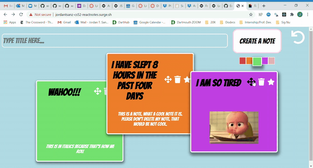
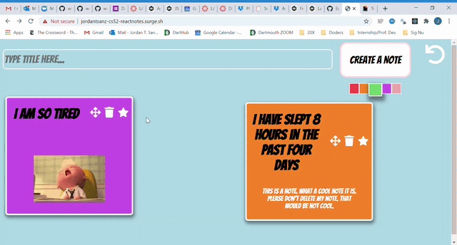
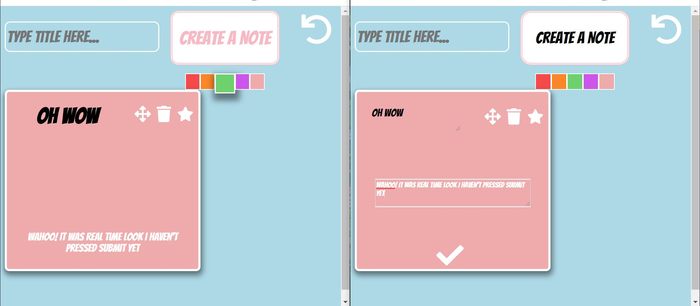

# Lab 3: React Notes

*This is my react notes website for Lab 3! Enjoy chatting with friends in real-time by posting notes. This was made by using React with a web-package.*

[React Notes Website](http://jordantsanz-cs52-reactnotes.surge.sh/)

## What Worked Well
Once I got the hang of the syntax of React, it was really simple to add elements in and make things more exciting. Using props was really useful to transfer information to and from components. 

## What Didn't
It was really difficult to understand the syntax of React at first. Conceptually, I somewhat understood it, but then finding the differences between state and props and trying to implement that was very tedious and unintuitive at first. Additionally, implementing firebase was likewise unintuitive at first, but once I understood what was going on, it was much easier. It was also hard to put a delay on certain functions. 

## Extra Credit!
* Z-index implemented: when you drag a note, it comes to the front, and everything else stays in the back
* Color choice: choose your note color before you make it by selecting a button!
* Undo: you can undo the deletion of your last note
* Rotate button: click on the star on a note, and the entire note rotates and changes color in a fun animation
* Realtime Editing: the edits occur in real-time!
* General styling: I really enjoy this part, probably not extra credit but I have fun doing this
* Textboxes auto-grow on typing

## Screenshots
Couldn't figure out how to screen record multiple browsers, but tried my best to show some stuff: 

*Here's an example of my z-index working and my autotextbox working.*

*Here's an example of the star rotate animation, the delete and undo working, and the creation of a new note and selecting its color, and then editing it.*

*Here's a screenshot of two browsers; I'm editing the note still on one browser, but it's showing up in real-time on the other browser!*
